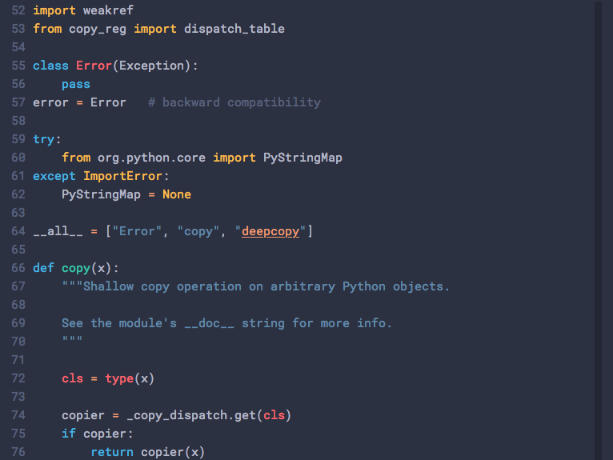

# Totem

A color scheme designed to be eye-friendly and relaxing.

## Usage & preview

### iTerm2

* Click on iTerm2 menu title
* Select `Preferences...` option
* Navigate to `Profiles` tab
* Navigate to `Colors` tab under the currently activated profile
* Click on `Color Presets...` dropdown on the bottom right corner
* Click on `Import...` option at the bottom
* Select the `iterm2/Totem.itermcolors` file of this repository
* Click on `Color Presets...` again and choose `Totem`

### Vim

* Copy `vim/Totem.vim` file to `~/.vim/colors/` directory
* Edit your Vim configuration file (usually `~/.vimrc`) and add the following
  line to choose the Totem color scheme `colorscheme Totem`
* Save and exit. Next time you launch Vim, the Totem color scheme should be
  chosen

### Lightline for Vim

* Copy `lightline/totem.vim` under
  `{{lightline}}/autoload/lightline/colorscheme/`, where `{{lightline}}` is
  lightline's install directory (`~/.vim/plugged/lightline.vim` in my case).
* Edit your Vim configuration file (usually `~/.vimrc`) and add the following
  line to choose the Totem lightline color scheme
  `let g:lightline = {'colorscheme': 'totem'}`
* Save and exit. Next time you launch Vim, the Totem color scheme should be
  chosen

